# 바이브코딩 커뮤니티 - 데이터베이스 & 시스템 아키텍처

**작성일**: 2025-11-04
**버전**: 1.0
**대상**: 바이브코딩 커뮤니티 플랫폼 개발팀
**목적**: 데이터베이스 구조, Zanzibar 권한 시스템, Admin 아키텍처 통합 문서

---

## 📋 목차

1. [시스템 개요](#1-시스템-개요)
2. [데이터베이스 스키마](#2-데이터베이스-스키마)
3. [Zanzibar 권한 시스템](#3-zanzibar-권한-시스템)
4. [Admin 시스템 아키텍처](#4-admin-시스템-아키텍처)
5. [시스템 의존성 관계도](#5-시스템-의존성-관계도)
6. [권한 시나리오](#6-권한-시나리오)
7. [API Routes & 권한 보호](#7-api-routes--권한-보호)

---

## 1. 시스템 개요

### 1.1 기술 스택

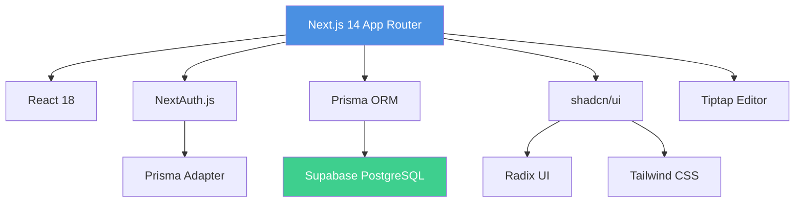

### 1.2 핵심 아키텍처 결정

| 항목 | 기술/패턴 | 이유 |
|------|----------|------|
| **프레임워크** | Next.js 14 App Router | SSR, RSC, File-based Routing |
| **데이터베이스** | Supabase PostgreSQL | Managed DB, Realtime, RLS |
| **ORM** | Prisma | Type-safe, Migration, Client Generation |
| **인증** | NextAuth.js | OAuth, Session Management |
| **권한 시스템** | Zanzibar (Google) | ReBAC, Scalable, Flexible |
| **UI 라이브러리** | shadcn/ui | Customizable, Accessible |

---

## 2. 데이터베이스 스키마

### 2.1 전체 테이블 구조

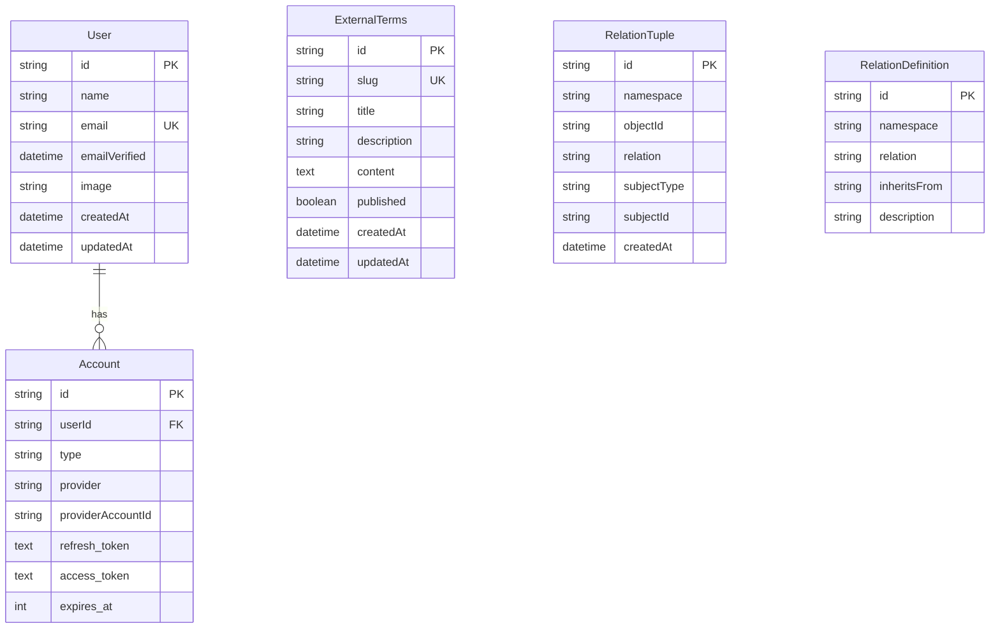

### 2.2 테이블 상세

#### User (사용자)
```prisma
model User {
  id            String    @id @default(cuid())
  name          String?
  email         String    @unique
  emailVerified DateTime?
  image         String?
  accounts      Account[]
  createdAt     DateTime  @default(now())
  updatedAt     DateTime  @updatedAt
}
```

**용도**: NextAuth.js 사용자 정보 저장
**관계**: Account와 1:N 관계

---

#### Account (OAuth 계정)
```prisma
model Account {
  id                String  @id @default(cuid())
  userId            String
  type              String
  provider          String  // 'github', 'google'
  providerAccountId String
  refresh_token     String? @db.Text
  access_token      String? @db.Text
  expires_at        Int?
  token_type        String?
  scope             String?
  id_token          String? @db.Text
  session_state     String?

  user User @relation(fields: [userId], references: [id], onDelete: Cascade)

  @@unique([provider, providerAccountId])
}
```

**용도**: OAuth 인증 정보 (GitHub, Google)
**관계**: User와 N:1 관계

---

#### ExternalTerms (약관)
```prisma
model ExternalTerms {
  id          String   @id @default(cuid())
  slug        String   @unique  // URL 식별자 (예: 'privacy-policy')
  title       String
  description String?
  content     String   @db.Text  // Markdown 콘텐츠
  published   Boolean  @default(false)
  createdAt   DateTime @default(now())
  updatedAt   DateTime @updatedAt
}
```

**용도**: 이용약관, 개인정보처리방침 등 관리
**특징**: Markdown 지원, 발행 상태 관리

---

#### RelationTuple (Zanzibar 권한 튜플)
```prisma
model RelationTuple {
  id          String   @id @default(cuid())

  namespace   String   // 'post', 'comment', 'category', 'system'
  objectId    String   // 리소스 ID
  relation    String   // 'owner', 'editor', 'viewer', 'moderator', 'admin'
  subjectType String   // 'user', 'group', 'user_set'
  subjectId   String   // User ID 또는 '*' (와일드카드)

  createdAt   DateTime @default(now())

  @@unique([namespace, objectId, relation, subjectType, subjectId])
  @@index([namespace, objectId, relation])
  @@index([subjectType, subjectId])
  @@index([namespace, relation, subjectId])
  @@map("relation_tuples")
}
```

**용도**: Google Zanzibar 권한 시스템의 핵심 테이블
**튜플 형식**: `(namespace:objectId, relation, subjectType:subjectId)`
**예시**: `(post:123, owner, user:alice)` → alice는 post:123의 owner

**인덱스 전략**:
- `[namespace, objectId, relation]`: 권한 체크 최적화
- `[subjectType, subjectId]`: 사용자 권한 조회
- `[namespace, relation, subjectId]`: 리스트 필터링

---

#### RelationDefinition (권한 관계 정의)
```prisma
model RelationDefinition {
  id           String  @id @default(cuid())
  namespace    String  // 'post', 'comment', 'system'
  relation     String  // 'owner', 'editor', 'viewer'
  inheritsFrom String? // 상속 관계 (예: 'editor' → 'viewer')
  description  String?

  @@unique([namespace, relation])
  @@map("relation_definitions")
}
```

**용도**: 권한 상속 관계 문서화 (선택적)
**예시**: `editor` relation이 `viewer`를 상속

---

## 3. Zanzibar 권한 시스템

### 3.1 Zanzibar 개요

Google Zanzibar는 **Relationship-Based Access Control (ReBAC)** 패턴을 사용하는 분산 권한 시스템입니다.

**핵심 개념**:
- **Tuple**: `(namespace:objectId, relation, subjectType:subjectId)` 형태의 권한 관계
- **Check API**: 권한 확인
- **Write API**: 권한 부여
- **Delete API**: 권한 제거

**참고**: [Google Zanzibar 논문 (2019)](https://research.google/pubs/pub48190/)

---

### 3.2 Namespace & Relation

#### Namespace (리소스 종류)
```yaml
post:       게시글
comment:    댓글
category:   카테고리
system:     시스템 전역
question:   Q&A 질문
answer:     Q&A 답변
```

#### Relation (관계 종류)
```yaml
# 일반 리소스 권한
owner:      소유자 (생성/읽기/수정/삭제)
editor:     편집자 (읽기/수정)
viewer:     열람자 (읽기)

# 시스템 레벨 권한
admin:      시스템 관리자 (모든 권한)
moderator:  모더레이터 (관리/삭제)
member:     멤버 (기본 접근)
```

---

### 3.3 권한 상속 구조

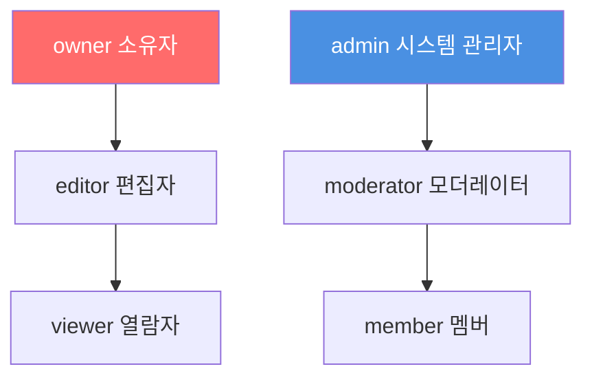

**상속 예시**:
- `owner` 권한 보유 → `editor`, `viewer` 권한 자동 보유
- `admin` 권한 보유 → `moderator`, `member` 권한 자동 보유

**구현** (`lib/permissions.ts`):
```typescript
const inheritanceMap: Record<Relation, Relation[]> = {
  viewer: [],
  editor: ['viewer'],
  owner: ['editor', 'viewer'],
  member: [],
  moderator: ['member'],
  admin: ['moderator', 'member'],
}
```

---

### 3.4 권한 튜플 예시

```typescript
// alice는 게시글 123의 소유자
(post:123, owner, user:alice)

// bob은 자유게시판 카테고리의 모더레이터
(category:free, moderator, user:bob)

// admin_user는 시스템 전체 관리자
(system:global, admin, user:admin_user)

// 게시글 456은 모든 사용자에게 공개 (와일드카드)
(post:456, viewer, user:*)

// charlie는 게시글 123의 편집자
(post:123, editor, user:charlie)
```

---

### 3.5 권한 체크 흐름도

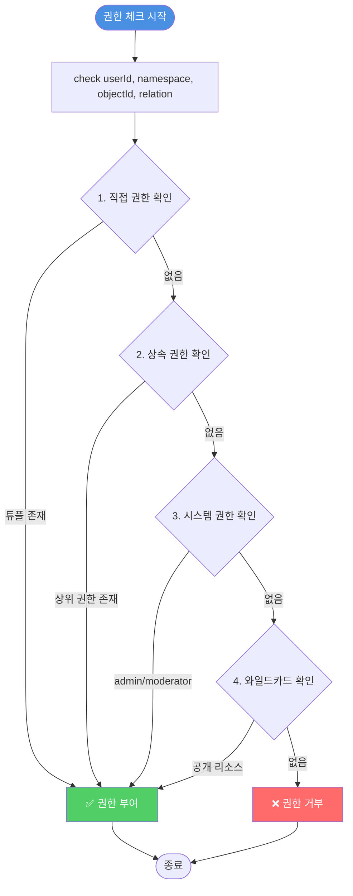

**권한 체크 로직** (`lib/permissions.ts:check()`):
1. **직접 권한**: `(namespace, objectId, relation, user, userId)` 튜플 조회
2. **상속 권한**: `owner` → `editor` → `viewer` 계층 확인
3. **시스템 권한**: `(system, global, admin, user, userId)` 조회
4. **와일드카드**: `(namespace, objectId, relation, user, *)` 조회

---

### 3.6 권한 API

#### Check API (권한 확인)
```typescript
export async function check(
  userId: string,
  namespace: Namespace,
  objectId: string,
  relation: Relation
): Promise<boolean>

// 예시
const canEdit = await check('alice', 'post', '123', 'editor')
// alice가 post:123을 editor로 접근 가능한가?
```

#### Write API (권한 부여)
```typescript
export async function grant(
  namespace: Namespace,
  objectId: string,
  relation: Relation,
  subjectType: SubjectType,
  subjectId: string
): Promise<RelationTuple | null>

// 예시
await grant('post', '123', 'owner', 'user', 'alice')
// alice에게 post:123의 owner 권한 부여
```

#### Delete API (권한 제거)
```typescript
export async function revoke(
  namespace: Namespace,
  objectId: string,
  relation: Relation,
  subjectType: SubjectType,
  subjectId: string
): Promise<void>

// 예시
await revoke('post', '123', 'editor', 'user', 'bob')
// bob의 post:123 editor 권한 제거
```

---

## 4. Admin 시스템 아키텍처

### 4.1 Admin 권한 계층

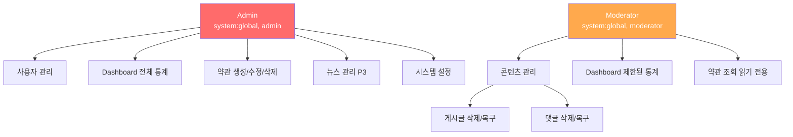

**권한 비교**:

| 기능 | Admin | Moderator |
|------|-------|-----------|
| Dashboard (통계) | ✅ 전체 | ✅ 제한 |
| 사용자 관리 | ✅ | ❌ |
| 콘텐츠 관리 (삭제/복구) | ✅ | ✅ |
| 약관 관리 | ✅ 생성/수정/삭제 | ✅ 읽기 전용 |
| 뉴스 관리 (P3) | ✅ | ❌ |
| 카테고리 관리 (P3) | ✅ | ❌ |
| 시스템 설정 | ✅ | ❌ |

---

### 4.2 Admin 페이지 구조

```
app/admin/
├── layout.tsx              # Admin Layout (권한 체크 + Sidebar)
├── page.tsx                # Dashboard (통계)
├── users/
│   └── page.tsx            # 사용자 관리 (Admin only)
├── content/
│   ├── posts/page.tsx      # 게시글 관리
│   └── comments/page.tsx   # 댓글 관리
├── terms/                  # 약관 관리 (기존)
│   ├── page.tsx
│   ├── new/page.tsx
│   └── [id]/edit/page.tsx
├── news/ (P3)              # 뉴스 관리
└── settings/ (P3)          # 시스템 설정
```

**Admin Layout** (`app/admin/layout.tsx`):
```typescript
export default async function AdminLayout({ children }) {
  const session = await getServerSession(authOptions)

  // 권한 체크: moderator 이상 필요
  try {
    await requireModerator(session?.user?.id)
  } catch (error) {
    redirect('/')  // 권한 없으면 홈으로 리다이렉트
  }

  const user = await prisma.user.findUnique({
    where: { id: session!.user!.id },
    select: { role: true },
  })

  return (
    <div className="flex min-h-screen">
      <AdminSidebar userRole={user!.role} />
      <main className="flex-1 p-8">{children}</main>
    </div>
  )
}
```

---

### 4.3 Admin 권한 미들웨어

**파일**: `lib/admin-middleware.ts`

```typescript
import { check, checkAny } from '@/lib/permissions'

// 관리자 전용 (Admin만)
export async function requireAdmin(userId: string | undefined): Promise<void> {
  if (!userId) {
    throw new Error('Unauthorized: 로그인이 필요합니다.')
  }

  const isAdmin = await check(userId, 'system', 'global', 'admin')

  if (!isAdmin) {
    throw new Error('Forbidden: 관리자 권한이 필요합니다.')
  }
}

// 모더레이터 이상 (Moderator + Admin)
export async function requireModerator(userId: string | undefined): Promise<void> {
  if (!userId) {
    throw new Error('Unauthorized: 로그인이 필요합니다.')
  }

  const hasPermission = await checkAny(
    userId,
    'system',
    'global',
    ['admin', 'moderator']
  )

  if (!hasPermission) {
    throw new Error('Forbidden: 모더레이터 이상의 권한이 필요합니다.')
  }
}
```

**사용 예시**:
```typescript
// Admin 전용 API
export async function POST(request: NextRequest) {
  const session = await getServerSession(authOptions)
  await requireAdmin(session?.user?.id)  // Admin만 접근 가능
  // ...
}

// Moderator 이상 API
export async function DELETE(request: NextRequest) {
  const session = await getServerSession(authOptions)
  await requireModerator(session?.user?.id)  // Moderator + Admin
  // ...
}
```

---

### 4.4 역할 변경 & Zanzibar 권한 부여

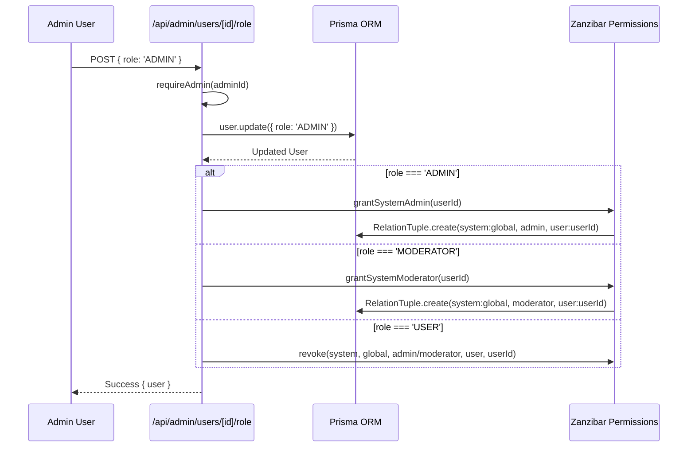

**구현 코드** (`app/api/admin/users/[id]/role/route.ts`):
```typescript
export async function POST(request: NextRequest, context: RouteContext) {
  const session = await getServerSession(authOptions)
  await requireAdmin(session?.user?.id)  // Admin만 역할 변경 가능

  const { id } = await context.params
  const { role } = await request.json()  // 'USER' | 'MODERATOR' | 'ADMIN'

  // 1. User 테이블 역할 업데이트
  const user = await prisma.user.update({
    where: { id },
    data: { role },
  })

  // 2. Zanzibar 권한 부여
  if (role === 'ADMIN') {
    await grantSystemAdmin(id)  // (system:global, admin, user:id)
  } else if (role === 'MODERATOR') {
    // 기존 admin 권한 제거
    await revoke('system', 'global', 'admin', 'user', id)
    await grantSystemModerator(id)  // (system:global, moderator, user:id)
  } else {
    // USER로 변경 시 모든 시스템 권한 제거
    await revoke('system', 'global', 'admin', 'user', id)
    await revoke('system', 'global', 'moderator', 'user', id)
  }

  return NextResponse.json({ user })
}
```

---

## 5. 시스템 의존성 관계도

### 5.1 기술 스택 의존성

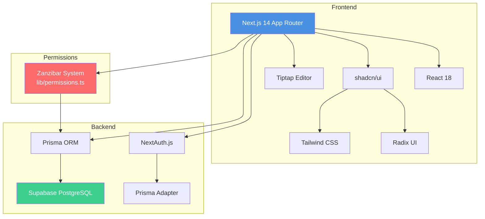

---

### 5.2 데이터 흐름

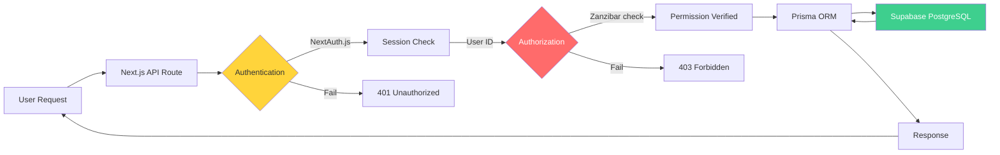

**흐름 설명**:
1. 사용자 요청 → Next.js API Route
2. **인증 (Authentication)**: NextAuth 세션 확인
3. **인가 (Authorization)**: Zanzibar 권한 체크
4. 권한 통과 → Prisma ORM → Supabase PostgreSQL
5. 응답 반환

---

### 5.3 Admin 시스템 의존성

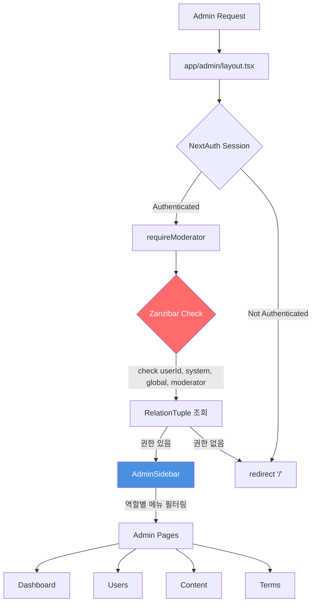

---

## 6. 권한 시나리오

### 6.1 일반 사용자 플로우

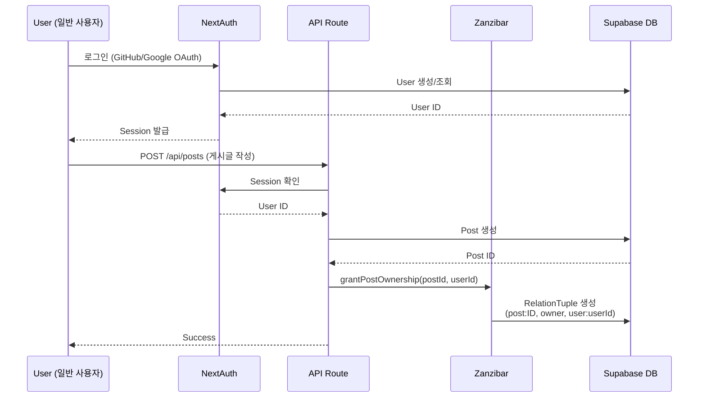

**권한 부여**:
- 게시글 작성 시 자동으로 `owner` 권한 부여
- `(post:123, owner, user:alice)` 튜플 생성

---

### 6.2 모더레이터 플로우

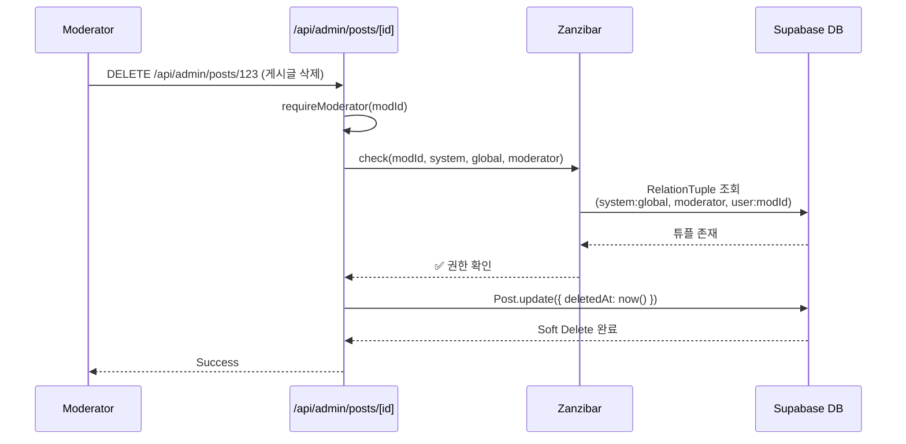

**권한 확인**:
- Moderator는 `(system:global, moderator, user:modId)` 튜플 보유
- `requireModerator()` 통과 → 게시글 삭제 가능

---

### 6.3 관리자 역할 변경 플로우

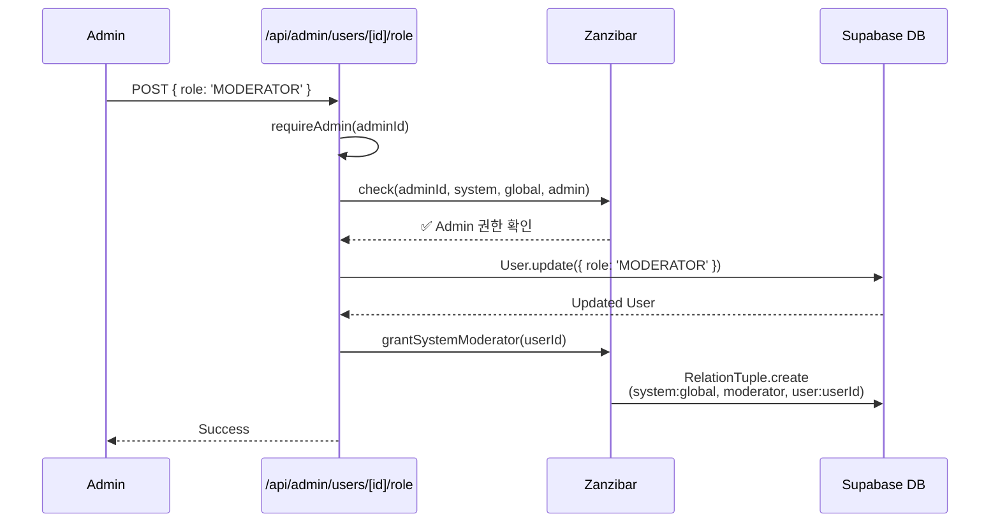

**권한 부여 프로세스**:
1. Admin이 역할 변경 요청
2. `requireAdmin()` 권한 체크
3. User 테이블 `role` 필드 업데이트
4. Zanzibar 튜플 생성: `(system:global, moderator, user:userId)`

---

### 6.4 권한 상속 확인 시나리오

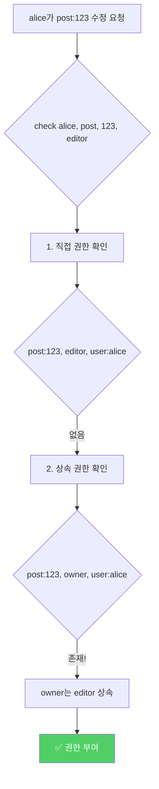

**시나리오**:
- alice는 `(post:123, owner, user:alice)` 튜플 보유
- `editor` 권한 체크 시, `owner`가 `editor`를 상속하므로 통과
- alice는 post:123을 수정 가능

---

## 7. API Routes & 권한 보호

### 7.1 Admin API Routes

| API Route | Method | 권한 | 설명 |
|-----------|--------|------|------|
| `/api/admin/stats` | GET | `requireModerator` | Dashboard 통계 |
| `/api/admin/users` | GET | `requireAdmin` | 사용자 목록 |
| `/api/admin/users/[id]/role` | POST | `requireAdmin` | 역할 변경 + Zanzibar 권한 부여 |
| `/api/admin/posts` | GET | `requireModerator` | 모든 게시글 조회 |
| `/api/admin/posts/[id]` | DELETE | `requireModerator` | 게시글 삭제 (soft delete) |
| `/api/admin/comments/[id]` | DELETE | `requireModerator` | 댓글 삭제 |
| `/api/admin/terms` | GET | `requireModerator` | 약관 목록 |
| `/api/admin/terms` | POST | `requireAdmin` | 약관 생성 |
| `/api/admin/terms/[id]` | PATCH | `requireAdmin` | 약관 수정 |
| `/api/admin/terms/[id]` | DELETE | `requireAdmin` | 약관 삭제 |

---

### 7.2 권한 보호 예시

**Dashboard 통계 API** (`app/api/admin/stats/route.ts`):
```typescript
export async function GET(request: NextRequest) {
  const session = await getServerSession(authOptions)
  await requireModerator(session?.user?.id)  // Moderator 이상 필요

  // 병렬 쿼리 (성능 최적화)
  const [totalUsers, totalPosts, totalComments] = await Promise.all([
    prisma.user.count(),
    prisma.post.count({ where: { deletedAt: null } }),
    prisma.comment.count({ where: { deletedAt: null } }),
  ])

  // DAU (Daily Active Users)
  const yesterday = new Date(Date.now() - 24 * 60 * 60 * 1000)
  const dau = await prisma.user.count({
    where: { lastActiveAt: { gte: yesterday } },
  })

  return NextResponse.json({
    stats: { totalUsers, totalPosts, totalComments, dau },
  })
}
```

---

**역할 변경 API** (`app/api/admin/users/[id]/role/route.ts`):
```typescript
export async function POST(request: NextRequest, context: RouteContext) {
  const session = await getServerSession(authOptions)
  await requireAdmin(session?.user?.id)  // Admin 전용

  const { id } = await context.params
  const { role } = await request.json()

  // User 테이블 업데이트
  const user = await prisma.user.update({
    where: { id },
    data: { role },
  })

  // Zanzibar 권한 부여
  if (role === 'ADMIN') {
    await grantSystemAdmin(id)
  } else if (role === 'MODERATOR') {
    await revoke('system', 'global', 'admin', 'user', id)
    await grantSystemModerator(id)
  } else {
    await revoke('system', 'global', 'admin', 'user', id)
    await revoke('system', 'global', 'moderator', 'user', id)
  }

  return NextResponse.json({ user })
}
```

---

**게시글 삭제 API** (`app/api/admin/posts/[id]/route.ts`):
```typescript
export async function DELETE(request: NextRequest, context: RouteContext) {
  const session = await getServerSession(authOptions)
  await requireModerator(session?.user?.id)  // Moderator 이상

  const { id } = await context.params

  // Soft Delete
  const post = await prisma.post.update({
    where: { id },
    data: { deletedAt: new Date() },
  })

  return NextResponse.json({ post })
}
```

---

## 8. 참고 문서

- [PRD.md](./PRD.md) - 제품 요구사항 문서
- [TASKS.md](./TASKS.md) - 구현 Task 목록
- [Supabase 설정 가이드](./Supabase_Setup_Guide.md)
- [Zanzibar 권한 시스템](./Zanzibar_Permission_System.md)
- [Google Zanzibar 논문 (2019)](https://research.google/pubs/pub48190/)
- [Prisma Documentation](https://www.prisma.io/docs)
- [NextAuth.js Documentation](https://next-auth.js.org/)

---

## 9. 변경 이력

| 버전 | 날짜 | 변경 사항 |
|------|------|-----------|
| 1.0 | 2025-11-04 | 초기 아키텍처 문서 작성<br>- 데이터베이스 스키마 (5개 테이블)<br>- Zanzibar 권한 시스템 구조<br>- Admin 시스템 아키텍처<br>- 시스템 의존성 관계도<br>- 권한 시나리오 (4가지)<br>- API Routes & 권한 보호 |

---

**문서 끝**
