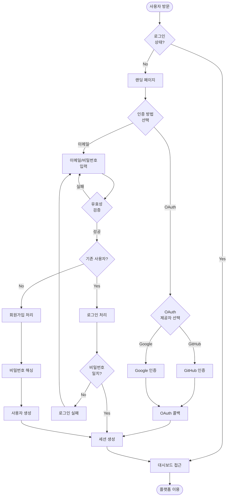
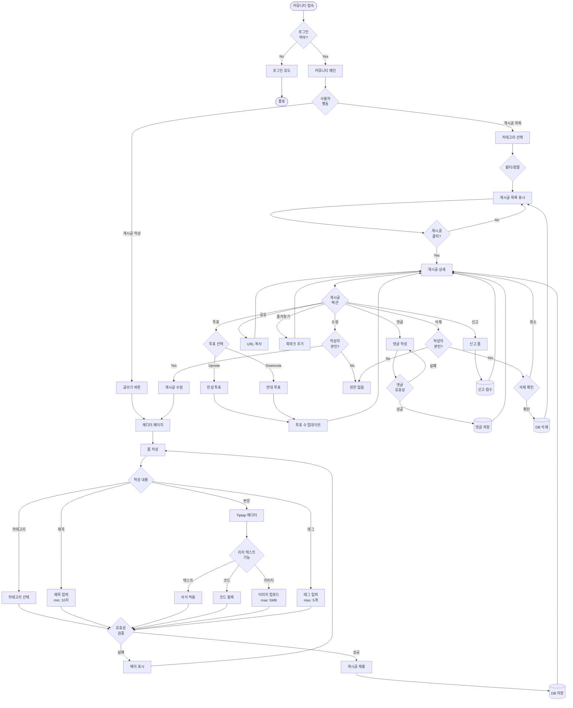
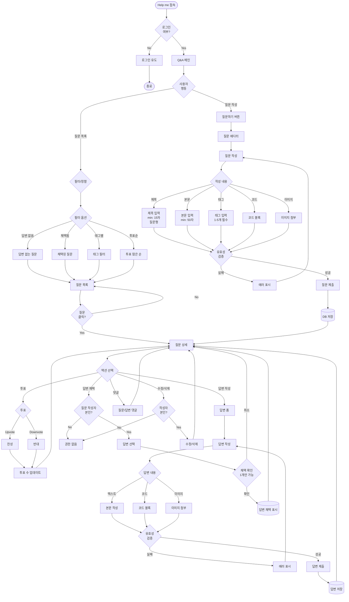
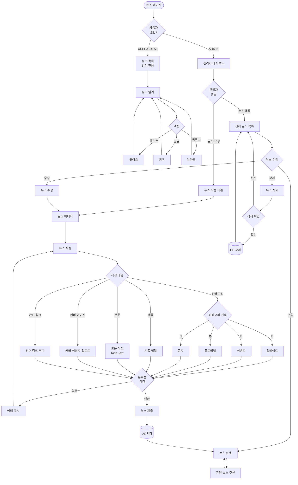
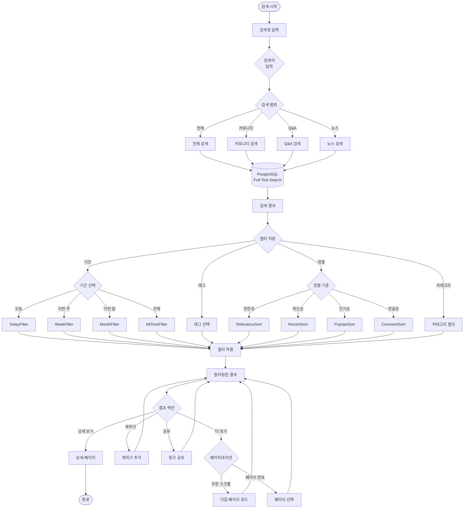
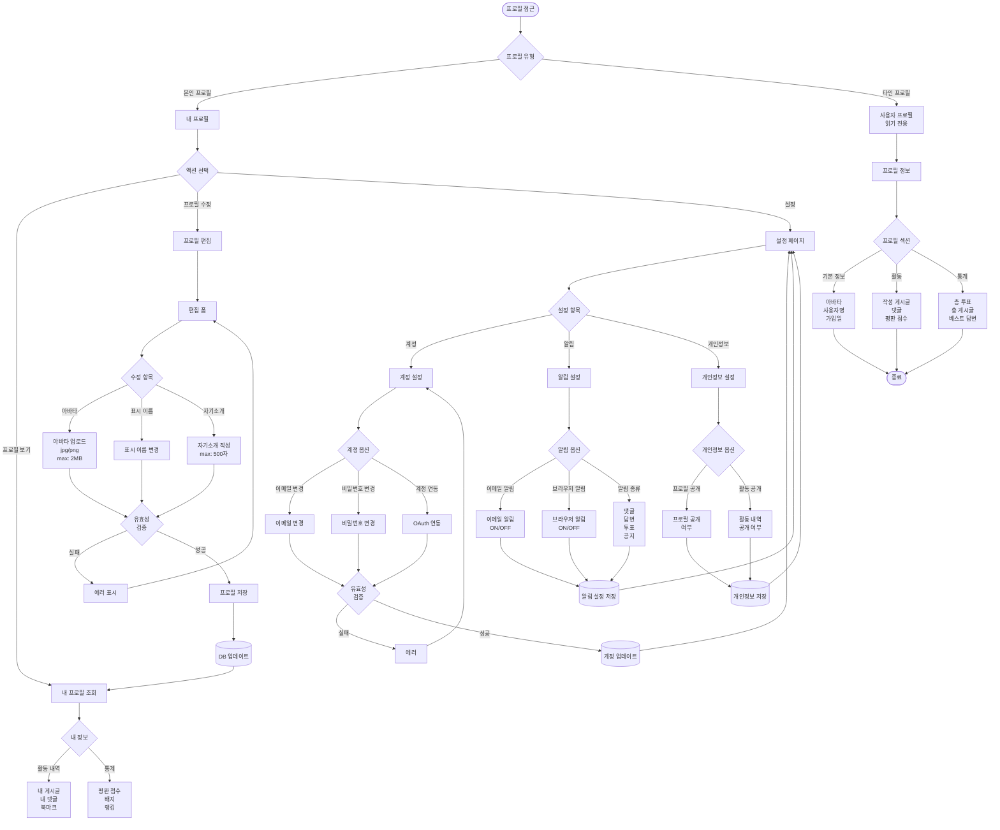
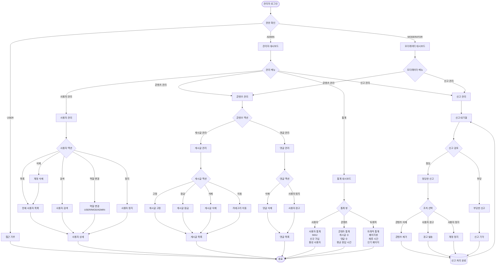
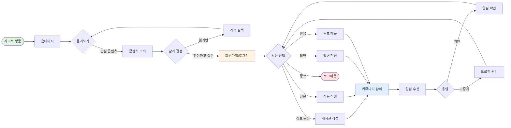
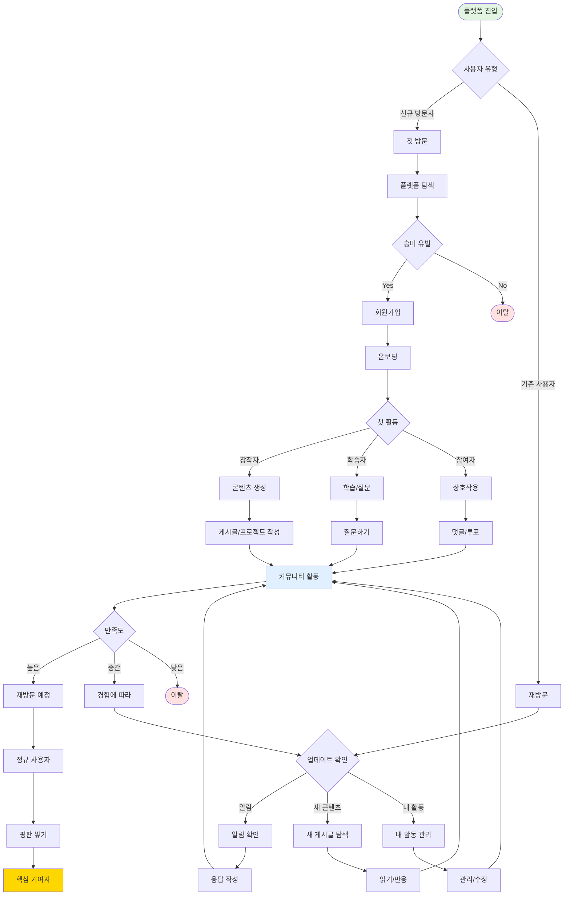
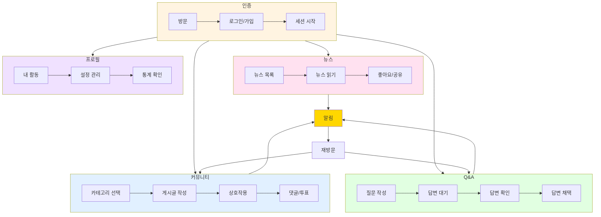

# 사용자 흐름 (User Flows)

바이브코딩 커뮤니티 플랫폼의 주요 사용자 흐름을 Mermaid 다이어그램으로 시각화한 문서입니다.

---

## 1. 인증 흐름 (Authentication Flow)

### 1.1 회원가입 및 로그인



---

## 2. 커뮤니티 게시글 흐름 (Community Post Flow)

### 2.1 게시글 작성 및 상호작용



---

## 3. Q&A 흐름 (Help me - Q&A Flow)

### 3.1 질문 작성 및 답변 채택



---

## 4. 뉴스 관리 흐름 (News Management Flow - 관리자)

### 4.1 뉴스 작성 및 관리 (관리자 전용)



---

## 5. 검색 및 필터링 흐름 (Search & Filtering Flow)

### 5.1 통합 검색



---

## 6. 프로필 관리 흐름 (Profile Management Flow)

### 6.1 사용자 프로필 조회 및 수정



---

## 7. 알림 흐름 (Notification Flow)

### 7.1 알림 수신 및 관리

```mermaid
flowchart TD
    Start([알림 트리거]) --> NotifTrigger{알림 이벤트}

    NotifTrigger -->|댓글| CommentNotif[내 게시글에<br/>댓글 작성됨]
    NotifTrigger -->|답변| AnswerNotif[내 질문에<br/>답변 작성됨]
    NotifTrigger -->|채택| AcceptNotif[내 답변이<br/>채택됨]
    NotifTrigger -->|투표| VoteNotif[내 게시글/답변에<br/>투표됨]
    NotifTrigger -->|멘션| MentionNotif[@username으로<br/>멘션됨]
    NotifTrigger -->|공지| SystemNotif[시스템 공지]

    CommentNotif --> CheckSettings
    AnswerNotif --> CheckSettings
    AcceptNotif --> CheckSettings
    VoteNotif --> CheckSettings
    MentionNotif --> CheckSettings
    SystemNotif --> CheckSettings

    CheckSettings{알림 설정<br/>확인} -->|OFF| IgnoreNotif[알림 무시]
    CheckSettings -->|ON| CreateNotif[알림 생성]

    CreateNotif --> NotifChannels{알림 채널}

    NotifChannels -->|인앱| InAppNotif[인앱 알림<br/>헤더 벨 아이콘]
    NotifChannels -->|이메일| EmailNotifSend[이메일 전송]
    NotifChannels -->|브라우저| BrowserNotif[브라우저 푸시]

    InAppNotif --> SaveNotifDB[(알림 DB 저장)]
    EmailNotifSend --> SaveNotifDB
    BrowserNotif --> SaveNotifDB

    SaveNotifDB --> UserChecks{사용자 확인}

    UserChecks -->|헤더 벨 클릭| NotifDropdown[알림 드롭다운]
    NotifDropdown --> NotifList[알림 목록]

    NotifList --> NotifActions{알림 액션}

    NotifActions -->|클릭| NavigateTo[해당 페이지로<br/>이동]
    NavigateTo --> MarkRead[(읽음 표시)]
    MarkRead --> End1([종료])

    NotifActions -->|읽음 표시| MarkAllRead[(모두 읽음<br/>표시)]
    MarkAllRead --> NotifList

    NotifActions -->|삭제| DeleteNotif[(알림 삭제)]
    DeleteNotif --> NotifList

    UserChecks -->|알림 설정| NotifSettings[알림 설정 페이지]
    NotifSettings --> AdjustSettings[설정 조정]
    AdjustSettings --> SaveSettings[(설정 저장)]
    SaveSettings --> End1
```

---

## 8. 관리자 대시보드 흐름 (Admin Dashboard Flow)

### 8.1 콘텐츠 관리 및 모더레이션



---

---

## 0. 전체 사용자 여정 (Overall User Journey)

### 0.1 일반 사용자의 간단한 행동 흐름



### 0.2 핵심 사용자 경로 (Key User Paths)



### 0.3 주요 기능별 사용자 흐름 요약



---

## 문서 정보

- **작성일**: 2025-10-21
- **기반 문서**: `docs/PRD.md` v1.2
- **다이어그램 도구**: Mermaid
- **총 흐름 수**: 11개 (전체 흐름 3개 + 세부 흐름 8개)
- **다이어그램 유형**: Flowchart TD/LR (Top-Down/Left-Right)

## 범례 (Legend)

### 다이어그램 노드 유형
- `([텍스트])`: 시작/종료 노드
- `[텍스트]`: 프로세스 노드
- `{텍스트}`: 의사결정 노드
- `[(텍스트)]`: 데이터베이스 작업
- `-->|레이블|`: 조건부 흐름
- `-->`: 일반 흐름

### 주요 색상 구분 (Mermaid 렌더링 시)
- 초록색: 성공 경로
- 빨간색: 실패/에러 경로
- 파란색: 일반 프로세스
- 노란색: 경고/확인 단계
